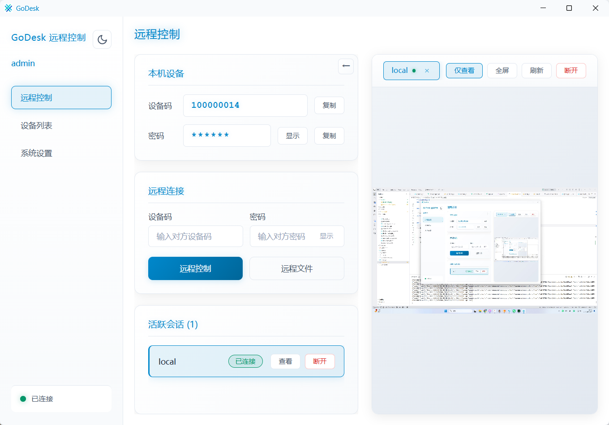
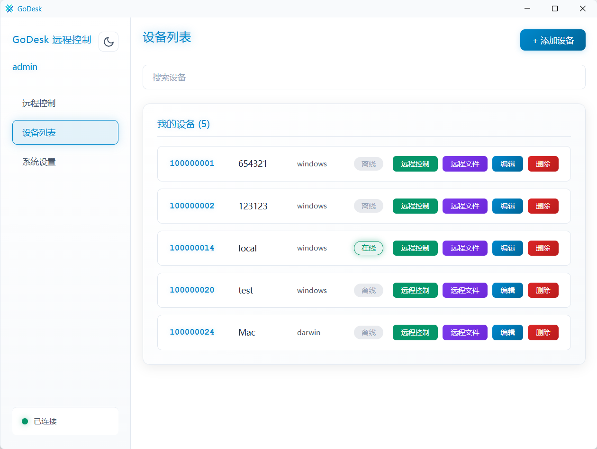

# GoDesk Client

`Remote Desktop Client` depend on **GO** 、 **Vue** 、 **Wails**

### Core Components

+ [Wails](https://wails.io)
+ [Golang](https://go.dev/)
+ [Vue 3](https://v3.vuejs.org/)

### Dev

+ 下载 [Msys2](https://www.msys2.org/)，安装 `mingw-w64 GCC` 工具

```bash
pacman -S mingw-w64-ucrt-x86_64-gcc
```

+ 项目运行

```shell
wails dev
```

+ proto文件生成

```shell
protoc -I ./proto --go_out=./proto/ --go_opt=paths=source_relative \
 --go-grpc_out=./proto/ --go-grpc_opt=require_unimplemented_servers=false \
 --go-grpc_opt=paths=source_relative ./proto/*.proto
```

### Build

```shell
wails build
```

### 项目截图

+ 远程控制界面

    

+ 设备列表界面

    
